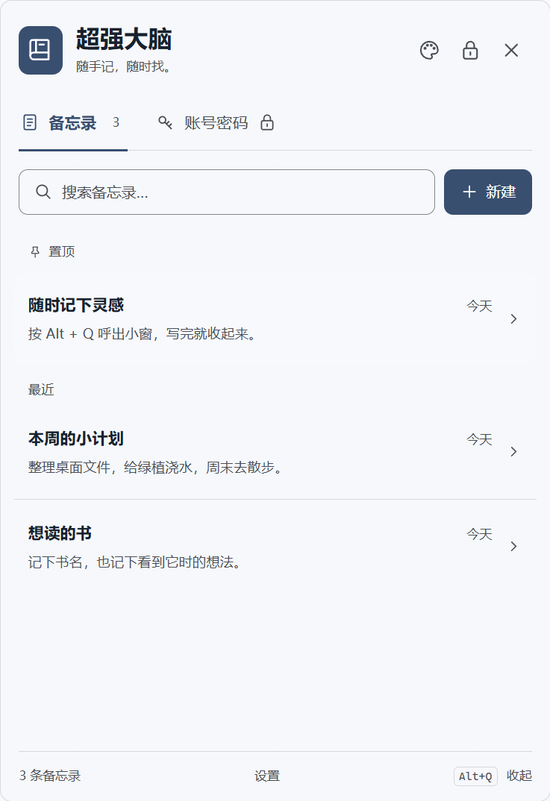

# 超强大脑 · 轻量版

双击即用的 Windows 备忘录小工具。默认按 **F8** 呼出或收起小窗，配置、备忘录和加密密码库放在运行文件旁边的 `data` 文件夹。

[下载最新版本](https://github.com/qzm-qzm/super-brain/releases/latest) · [使用说明](docs/使用说明.md) · [更新与发布](docs/更新与发布.md) · [数据与安全](docs/数据与安全.md)



## 直接运行

1. 下载 `SuperBrain-Lite-0.2.4-win-x64.zip`，解压到可写文件夹，例如 `D:\super-brain`。
2. 双击 **超强大脑.exe**。无需安装，不需要 Node.js、Electron、浏览器或管理员权限。
3. 按 **F8** 随时呼出和收起。要换快捷键，在设置里点击快捷键框，然后直接按键录入；关闭按钮收起到托盘；彻底退出请使用「设置 → 退出工具」或托盘菜单。
4. 外观按钮可调整配色、背景图片和 **0–100% 图片透明度**。
5. 设置中勾选「登录 Windows 后后台启动」并保存，下次登录桌面后即可用快捷键打开，无需先双击运行文件。开机时不会弹出窗口。

按住窗口顶部“超强大脑”标题可拖动小窗。移动或调整大小后，下次打开会回到上次的位置与尺寸；背景图片不会盖住记录卡片和按钮。

也可以直接下载单独的 `SuperBrain.exe`，放进文件夹后运行。该文件和压缩包内的 `超强大脑.exe` 内容一致。首次运行会创建 `data`，移动时请把运行文件和 `data` 一起带走。

运行文件约 **122 KB**，依赖 Windows 自带的 **.NET Framework 4.8 或更高版本**，面向 Windows 10/11 x64。没有捆绑浏览器运行环境。此体积指下载的运行文件，不代表进程内存占用。

后台只保留快捷键和托盘，按键后才启动窗口；收起时先保存资料、锁定密码库，再释放窗口进程。本机隔离测试中，待命工作集约 35–37 MiB，窗口打开时两个进程合计约 121–124 MiB，实际占用随系统和资料变化。后台没有定时轮询，也不读取备忘录或密码库。每次呼出需要重新加载界面。

## 功能

- 全局快捷键、托盘入口、窗口缩放、可选置顶；重复双击打开现有窗口。
- 可选登录后静默启动；收起时释放界面内存，后台继续响应快捷键。
- 紧凑搜索栏、卡片列表、备忘录新建/编辑/收藏筛选，删除后 10 秒内 `Ctrl+Z` 撤销；`Ctrl+F` 聚焦搜索。
- 独立加密密码库：主密码、账号/密码/网站/备注、显示与隐藏密码、复制、随机密码。
- 收起窗口、锁屏、休眠和闲置后锁定；锁定前已接受的修改保留。
- 六种主题、自定义背景色和主题色、本地背景图片、图片透明度。
- 本地备份与恢复、修改主密码、打开新版本下载页。

**普通备忘录为明文，账号密码加密保存。主密码不能找回。** 数据不上传 GitHub，只有主动打开下载页或仓库时使用浏览器访问网络。

## 本地文件

```text
超强大脑.exe
使用说明.txt
data/                    # 首次运行自动创建
  config.json            # 配色、图片、快捷键等
  notes.json             # 普通备忘录
  vault.enc.json         # 加密密码库，首次创建后生成
  *.bak                  # 上一版数据
  before-restore-*.json   # 恢复备份前保存的资料
```

资料不再存放到 C 盘 AppData。软件没有安装器。开启后台启动时只注册当前 Windows 用户的登录启动项，可在设置中关闭；不会修改 Windows 全局设置。移动或重命名运行文件后，请在新位置重新启用后台启动。若快捷键被占用，在设置中换一个即可。

## 构建与测试

源码为 C# / WPF，使用系统随 .NET Framework 提供的编译器。无需下载依赖；从 Windows PowerShell 7 / GitHub Actions 运行：

```powershell
./scripts/build-lite.ps1
./scripts/build-lite.ps1 -Tests
./dist-lite/NativeTests.exe ./test-results/native
powershell.exe -NoProfile -ExecutionPolicy Bypass -File ./scripts/smoke-lite.ps1 -Executable ./dist-lite/超强大脑.exe -TestRoot ./test-results/standalone
powershell.exe -NoProfile -ExecutionPolicy Bypass -File ./scripts/smoke-background.ps1 -Executable ./dist-lite/超强大脑.exe -TestRoot ./test-results/background
```

编译器默认位置为 `%WINDIR%/Microsoft.NET/Framework64/v4.0.30319/csc.exe`。测试仅使用指定的独立目录，覆盖密码派生参考向量、密文篡改、保存恢复、真实 WPF 窗口、快捷键和最终运行文件。

## 更新

退出工具后替换 `超强大脑.exe`，**保留 `data` 文件夹**。建议更新前从设置导出备份。当前通过下载页手动更新，不自动下载安装。

开发者更新版本后推送 `v版本号` 标签，GitHub Actions 自动编译、测试并发布轻量文件和 zip；参见[更新与发布](docs/更新与发布.md)。

## 与 v0.1.0 的关系

v0.2.0 用 Windows 原生界面替代 Electron。旧版源码和安装包保留在 [v0.1.0 标签](https://github.com/qzm-qzm/super-brain/tree/v0.1.0)和对应 Release；旧版 `%APPDATA%/SuperBrain` 资料不会被修改。

轻量版密码库使用独立的 v2 格式，**不能直接导入 v0.1.0 的加密备份**。已有旧版密码资料请先保留旧版与备份，在旧版解锁后迁入；不要直接把旧版数据覆盖到新 `data` 目录。

当前运行文件未做 Windows 代码签名，系统可能提示未知发布者。发布页附 SHA-256 校验文件。密码库尚未经过独立安全审计。

界面参考 [EcoPaste](https://github.com/EcoPasteHub/EcoPaste) 的紧凑小窗设计，使用 WPF 独立实现；详见[界面样式来源](docs/界面样式.md)。
